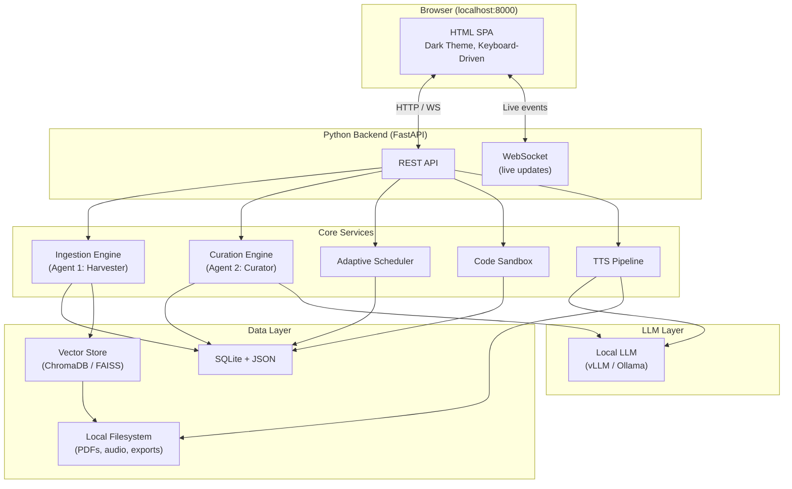

# Eudaimonia Learning System — Requirements & Phased Implementation Plan

## 1. Project Summary

**What we're building:** A fully local, offline, multi-agent learning engine that helps developers and researchers achieve deep focus and master complex technical topics. It is a software implementation of Cal Newport's "Eudaimonia Machine" — a sequence of five conceptual rooms (Gallery → Salon → Library → Office → Deep Work Chambers) mapped to software modules.

**Core value proposition:** The system ingests raw technical material (PDFs, markdown, web pages), structures it into a daily learning curriculum with active-recall assets (flashcards, quizzes, coding exercises), generates podcast-style audio for passive learning, and provides a distraction-free focus environment — all running locally with no cloud dependencies.

**Interface:** Local HTML web application served by a Python backend (e.g., FastAPI), accessed via browser at `localhost`. This replaces the Textual TUI from the original idea — HTML provides richer visuals, easier iteration, and broader accessibility while remaining fully local.

---

## 2. User Review Required

> [!NOTE]
> **Resolved: HTML UI** — Proceeding with HTML served locally via FastAPI. The browser is the interface — dark themed, keyboard-driven, single-page app.

> [!NOTE]
> **Resolved: LLM** — Ollama is available now. User prefers vLLM. See hardware analysis below for practical approach.

> [!NOTE]
> **Resolved: Audio** — TTS/podcast pipeline deferred to Phase 6 (lowest priority).

> [!NOTE]
> **Resolved: Docker** — Docker Desktop is available. Sandbox execution is viable.

> [!WARNING]
> **Hardware Reality Check: GTX 1650 (4GB VRAM) + 16GB RAM**
>
> The original idea.md assumes high-end GPU resources (FP8 quantization, 32K context, multi-LoRA with rank 64, Unsloth fine-tuning). The GTX 1650 significantly constrains what's practical:
>
> | Capability | Feasibility on 1650 | Practical Alternative |
> |---|---|---|
> | vLLM serving (7B+ models) | ❌ Needs 8–16GB VRAM | Use **Ollama** for inference (CPU+GPU hybrid offloading) or vLLM with **1–3B quantized models** |
> | vLLM FP8 quantization | ❌ Requires Ampere+ (SM 8.0+). 1650 is Turing SM 7.5 | Use GGUF/Q4 quantization via Ollama |
> | Unsloth fine-tuning (7B) | ❌ Needs ~12GB VRAM minimum | Fine-tune **1–3B models** with QLoRA, or use cloud GPU (Colab/RunPod) for fine-tuning, deploy locally |
> | Multi-LoRA hot-swap | ⚠️ Marginal with small models | Single adapter at a time |
> | TTS (Kokoro 82M) | ✅ Fits easily | Works fine |
> | Embeddings (MiniLM/BGE-small) | ✅ CPU is sufficient | Works fine |
>
> **Recommended strategy:**
> - **Phase 1–2**: No LLM needed. Build foundation.
> - **Phase 3**: Start with **Ollama** running a **Q4-quantized 3–7B model** (e.g., `qwen2.5:7b`, `llama3.2:3b`). Ollama handles CPU/GPU offloading transparently on your hardware.
> - **Later**: If you get access to a better GPU or cloud instance, switch the LLM abstraction layer to vLLM. The code will be designed with a **provider-agnostic interface** so this is a config change, not a rewrite.
> - **Fine-tuning**: Do on cloud GPU (Colab free tier or RunPod), export GGUF, deploy locally via Ollama.
>
> This is pragmatic — Ollama *works today* on your hardware. vLLM is the aspiration for when you scale up. The abstraction layer supports both.

---

## 3. Resolved Questions & Remaining Open Items

### Resolved
- **Topic scope**: Broad technical — ML, DL, Transformers, vLLM, Docker, LangChain/Agentic, Unsloth/Fine-tuning, Optical & Digital Comms, Computer Networks (L0–L3), Network Security, Electronic HW Design, Python Automation. System must be **topic-agnostic** in design.
- **Audio priority**: Deferred to Phase 6.
- **Docker**: Available via Docker Desktop.
- **Hardware**: 16GB RAM, NVIDIA GTX 1650 (4GB VRAM), Ollama installed.

### Still Open
1. **Existing content**: Do you already have PDFs/markdown/notes for any of these topics, or will we start from scratch with web ingestion?
2. **GitHub Pages gallery**: Prioritize local dashboard first, or set up GitOps pipeline early?

---

## 4. Architecture Overview



---

## 5. Technology Stack

| Layer | Technology | Rationale |
|-------|-----------|---------|
| **Backend** | Python 3.11+ / FastAPI | Async-native, Pydantic validation, WebSocket support |
| **Frontend** | Vanilla HTML + CSS + JS | No build step, locally served, rich aesthetics, keyboard-driven |
| **Database** | SQLite (via `aiosqlite`) | Zero-config, file-based, sufficient for single-user local app |
| **Vector Store** | ChromaDB | Local embedding search for RAG, persistent, easy Python API |
| **Embeddings** | `all-MiniLM-L6-v2` (384d, 22M) | CPU-friendly, no GPU needed, excellent quality/size ratio |
| **LLM Inference** | Ollama (now) → vLLM (later) | Ollama works on 1650 today; vLLM when better GPU available. Provider-agnostic abstraction layer. |
| **Recommended Models** | `qwen2.5:7b-instruct-q4_K_M` or `llama3.2:3b` | Fit in 4GB VRAM with Ollama's CPU/GPU split |
| **TTS** (Phase 6) | Kokoro (82M) or Piper | Small footprint, CPU-friendly, deferred |
| **Document Parsing** | PyMuPDF, markdown-it | Extract text from PDFs and markdown files |
| **Code Sandbox** | Docker + subprocess | Isolated execution with resource limits via Docker Desktop |
| **Task Orchestration** | Python asyncio + LangChain | Lightweight agent coordination |

---

## 6. Phased Implementation

### Phase 1 — Foundation: Data Layer + Static UI Shell
**Goal:** Establish the project skeleton, database schema, and a working HTML dashboard with mock data. No LLM required.

**Deliverables:**
- [ ] Project structure (FastAPI app, static file serving, directory layout)
- [ ] SQLite schema for: topics, daily plans, sub-topics, flashcards, quizzes, exercises, milestones
- [ ] Pydantic models matching the schema (from idea.md: `TerminologyCard`, `MultipleChoiceQuiz`, `AlgorithmicExercise`, `SubTopicUnit`, `DailyCurriculumPlan`)
- [ ] REST API endpoints:
  - `GET /api/topics` — list all topics
  - `POST /api/topics` — create a new topic
  - `GET /api/plans/{topic_id}` — get daily plans for a topic
  - `GET /api/plans/{topic_id}/day/{day}` — get a specific day's curriculum
- [ ] HTML dashboard (single-page, dark theme) with five "rooms":
  - **Gallery** — milestone progress display (static mock data)
  - **Salon** — placeholder for LLM chat (Phase 3)
  - **Library** — list of ingested documents (static mock data)
  - **Office** — daily schedule view with task checklist
  - **Deep Work Chamber** — focus timer (90-min Pomodoro with countdown)
- [ ] Focus timer with start/pause/reset, visual countdown, and session tracking
- [ ] Keyboard shortcuts for room navigation

**Acceptance Criteria:**
- Server starts on `localhost:8000` and serves the dashboard
- Focus timer counts down 90 minutes and logs completed sessions
- API returns mock curriculum data; UI renders it
- All tests pass (API endpoint tests, Pydantic validation tests)

---

### Phase 2 — Content Ingestion Pipeline (Agent 1: Knowledge Harvester)
**Goal:** Ingest local files (PDF, markdown, text) into the database and vector store. No LLM required for basic ingestion.

**Deliverables:**
- [ ] File watcher / upload endpoint: `POST /api/ingest` (accepts file paths or uploaded files)
- [ ] Document parsers:
  - PDF → plain text (PyMuPDF)
  - Markdown → structured sections
  - Plain text → chunks
- [ ] Text chunking pipeline (configurable chunk size, overlap)
- [ ] Vector embedding + storage (ChromaDB with a lightweight local embedding model, e.g., `all-MiniLM-L6-v2`)
- [ ] Deduplication (content hashing to avoid re-ingesting identical content)
- [ ] Library room update: display ingested documents with metadata (title, page count, chunk count, ingest date)
- [ ] Search endpoint: `GET /api/search?q=...` — semantic search over ingested content
- [ ] Library room: search bar with live results

**Acceptance Criteria:**
- Ingesting a PDF produces searchable chunks in the vector store
- Duplicate files are detected and skipped
- Semantic search returns relevant chunks for a query
- Library UI shows ingested documents and supports search

---

### Phase 3 — Curriculum Generation (Agent 2: Instructional Curator)
**Goal:** Use a local LLM to generate structured learning curricula from ingested content.

**Deliverables:**
- [ ] LLM integration layer (abstraction over Ollama / vLLM API)
- [ ] Curriculum generation pipeline:
  - Accept a topic + ingested content
  - Generate a multi-day `DailyCurriculumPlan` via LLM
  - Validate output against Pydantic schemas
  - Store in SQLite
- [ ] Active recall asset generation:
  - Flashcards (`TerminologyCard`)
  - Quizzes (`MultipleChoiceQuiz`)
  - Coding exercises (`AlgorithmicExercise`)
- [ ] Office room: display generated daily plans, navigate between days
- [ ] Deep Work Chamber: render today's study material (summaries, flashcards, quizzes)
- [ ] Interactive flashcard UI (flip animation, mark known/unknown)
- [ ] Interactive quiz UI (select answer, show explanation, track score)

**Acceptance Criteria:**
- Given ingested content, the system generates a valid multi-day curriculum
- Flashcards, quizzes, and exercises render correctly in the UI
- Quiz scoring works and persists across sessions
- Curriculum regeneration doesn't lose prior progress

---

### Phase 4 — Code Sandbox & Exercise Verification
**Goal:** Safely execute user-submitted code and verify it against generated test suites.

**Deliverables:**
- [ ] Sandbox execution service:
  - Docker-based isolated container (network disabled, read-only root, resource limits)
  - `POST /api/sandbox/execute` endpoint
  - Import validation (banned module list)
  - Timeout enforcement
- [ ] Deep Work Chamber: integrated code editor (CodeMirror or Monaco)
  - Load starter code from exercise
  - Run against test suite
  - Display stdout/stderr/pass-fail results
- [ ] Exercise progress tracking (attempted, passed, failed) stored in SQLite
- [ ] Gallery room: update milestone display based on completed exercises

**Acceptance Criteria:**
- User code runs in an isolated Docker container
- Malicious imports are blocked
- Infinite loops / memory bombs are terminated within timeout
- Passing all tests for an exercise marks it complete in the Gallery

---

### Phase 5 — Socratic Chat & RAG (The Salon)
**Goal:** Interactive LLM chat grounded in ingested knowledge (RAG).

**Deliverables:**
- [ ] Salon room: full chat interface (message history, streaming responses)
- [ ] RAG pipeline: user query → vector search → context injection → LLM response
- [ ] Conversation history storage (SQLite)
- [ ] Context attribution: show which source documents were used for each answer
- [ ] WebSocket-based streaming for real-time token delivery

**Acceptance Criteria:**
- User can ask questions about ingested material and receive grounded answers
- Responses cite source documents
- Chat history persists across sessions
- Streaming responses render token-by-token in the UI

---

### Phase 6 — Audio Synthesis & Gallery GitOps (Polish)
**Goal:** Generate podcast-style audio for passive learning; automate progress visualization.

**Deliverables:**
- [ ] Podcast generation pipeline (6-stage process from idea.md):
  - Content selection → episode profile → speaker config → outline → dialogue → TTS
  - Audio merging with ffmpeg
- [ ] Audio player in the Deep Work Chamber (play during recovery breaks)
- [ ] Mermaid.js concept map generation from completed milestones
- [ ] Gallery room: render Mermaid diagrams inline
- [ ] (Optional) GitOps pipeline: auto-commit diagrams, GitHub Actions for rendering, GitHub Pages deployment

**Acceptance Criteria:**
- Given a day's curriculum, the system generates a listenable audio file
- Audio plays in the browser
- Concept maps render correctly from milestone data
- (If GitOps enabled) Pushing to GitHub triggers diagram rendering and Pages deployment

---

## 7. Verification Plan

### Automated Tests
Each phase will have:
- **Unit tests** for Pydantic models, database operations, and business logic
- **Integration tests** for API endpoints (using `httpx` + `pytest`)
- **Frontend tests** where applicable (basic DOM assertions)

```bash
# Run all tests
pytest tests/ -v

# Run tests for a specific phase
pytest tests/phase1/ -v
```

### Manual Verification
- **Phase 1:** Open `localhost:8000` in browser, verify dashboard renders, focus timer works, keyboard navigation works
- **Phase 2:** Ingest a sample PDF, verify it appears in Library, verify search returns relevant results
- **Phase 3:** Generate curriculum for an ingested topic, verify flashcards/quizzes render correctly
- **Phase 4:** Submit correct and incorrect code, verify sandbox catches errors and unsafe imports
- **Phase 5:** Chat with the system about ingested content, verify RAG citations
- **Phase 6:** Generate audio, play in browser, verify concept maps render

---

## 8. Directory Structure (Proposed)

```
eudaimonia/
├── AGENTS.md
├── idea.md
├── requirements.md          # This document
├── pyproject.toml            # Project dependencies
├── src/
│   ├── __init__.py
│   ├── main.py               # FastAPI app entry point
│   ├── config.py             # Settings / environment config
│   ├── models/               # Pydantic schemas
│   │   ├── __init__.py
│   │   ├── curriculum.py     # DailyCurriculumPlan, SubTopicUnit, etc.
│   │   ├── content.py        # Ingested document models
│   │   └── session.py        # Focus session, progress models
│   ├── db/                   # Database layer
│   │   ├── __init__.py
│   │   ├── database.py       # SQLite connection, migrations
│   │   └── repositories.py   # CRUD operations
│   ├── services/             # Business logic
│   │   ├── __init__.py
│   │   ├── ingestion.py      # Agent 1: Knowledge Harvester
│   │   ├── curation.py       # Agent 2: Instructional Curator
│   │   ├── scheduler.py      # Adaptive daily scheduler
│   │   ├── sandbox.py        # Code execution sandbox
│   │   ├── llm.py            # LLM abstraction layer
│   │   ├── tts.py            # Text-to-speech pipeline
│   │   └── gallery.py        # Mermaid diagram generation
│   ├── api/                  # FastAPI route handlers
│   │   ├── __init__.py
│   │   ├── topics.py
│   │   ├── plans.py
│   │   ├── ingest.py
│   │   ├── search.py
│   │   ├── sandbox.py
│   │   └── chat.py
│   └── static/               # Frontend assets
│       ├── index.html
│       ├── css/
│       │   └── style.css
│       └── js/
│           ├── app.js        # Main SPA logic
│           ├── rooms/        # Per-room UI modules
│           │   ├── gallery.js
│           │   ├── salon.js
│           │   ├── library.js
│           │   ├── office.js
│           │   └── chamber.js
│           └── components/   # Reusable UI components
│               ├── timer.js
│               ├── flashcard.js
│               ├── quiz.js
│               └── editor.js
├── tests/
│   ├── phase1/
│   ├── phase2/
│   ├── phase3/
│   ├── phase4/
│   ├── phase5/
│   └── phase6/
├── data/                     # Runtime data (gitignored)
│   ├── eudaimonia.db         # SQLite database
│   ├── vectorstore/          # ChromaDB persistence
│   ├── audio/                # Generated podcast files
│   └── uploads/              # Ingested source documents
├── docker/                   # Sandbox Dockerfile
│   └── Dockerfile.sandbox
└── gallery/                  # Mermaid diagrams for GitOps
    └── progress/
```

---

## 9. Phase 1 Detailed Breakdown (Ready to Execute)

Since Phase 1 has no external dependencies (no LLM, no Docker, no GPU), it can begin immediately. Here's the detailed task list:

### 1.1 Project Setup
- Initialize `pyproject.toml` with dependencies: `fastapi`, `uvicorn`, `aiosqlite`, `pydantic`, `pytest`, `httpx`
- Create directory structure
- Create `src/main.py` with basic FastAPI app serving static files

### 1.2 Pydantic Models
- Port schemas from idea.md: `TerminologyCard`, `MultipleChoiceQuiz`, `AlgorithmicExercise`, `SubTopicUnit`, `DailyCurriculumPlan`
- Add: `Topic`, `FocusSession`, `Milestone`

### 1.3 Database Layer
- SQLite schema creation script
- Repository classes with async CRUD operations
- Seed script with mock curriculum data (1 topic, 3 days, with flashcards + quizzes)

### 1.4 API Endpoints
- Topics CRUD
- Plans retrieval
- Focus session logging

### 1.5 HTML Dashboard
- Single-page app with room navigation (sidebar or tab bar)
- Dark theme with premium aesthetics (glassmorphism, gradients, micro-animations)
- Five room panels (Gallery, Salon placeholder, Library, Office, Chamber)
- 90-minute focus timer with visual countdown ring
- Keyboard shortcuts (1-5 for rooms, Space for timer, Esc for reset)

### 1.6 Tests
- Pydantic model validation tests
- API endpoint tests
- Database CRUD tests
